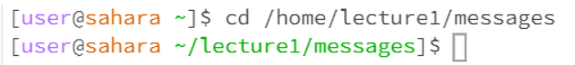
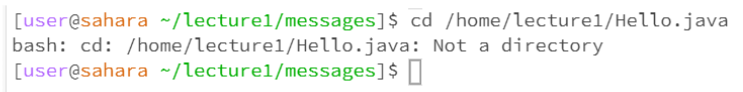

# Lab Report 1
***
For this Lab Report, I will be using the “lecture1” repository to show off the examples for each command.

**First command: cd**
1. An example of using “cd” without any arguments:
	
* Working Directory: In this case, the working directory was the initial working directory which can be referred to as home.
* There was no output, and the use case of the command “cd” with no arguments is to take you to your home directory, and as I already was in the home directory, there   was no change due to this command being run on the terminal.
* There was no error in the output.

2. An example of using “cd” with a path to a directory as an argument
	
* Working directory: In this case, the working directory was still home, but starting from the next command, it would be the messages directory.
* There was no output again, the use case “cd” with a path to a directory is to switch the working directory to the directory specified in the path.
* There was no error in the output

3.An example of using “cd” with a path to a directory as an argument
	
* Working directory: In this case, the working directory was messages which is a directory inside of lecture1. 
* The output was: “bash: cd: /home/lecture1.Hello.java: Not a directory,” and I got that output because we were trying to making the current directory a file which 
  is not possible.
* There was an error in the output because we use the “cd” command to switch the current working directory, and in this case, we were trying to switch it to a file   
  which is not a directory so we resulted in an error.
