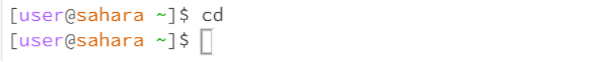

# Lab Report 1
***
For this Lab Report, I will be using the “lecture1” repository to show off the examples for each command.

First command: cd
  1. An example of using “cd” without any arguments:
  	
